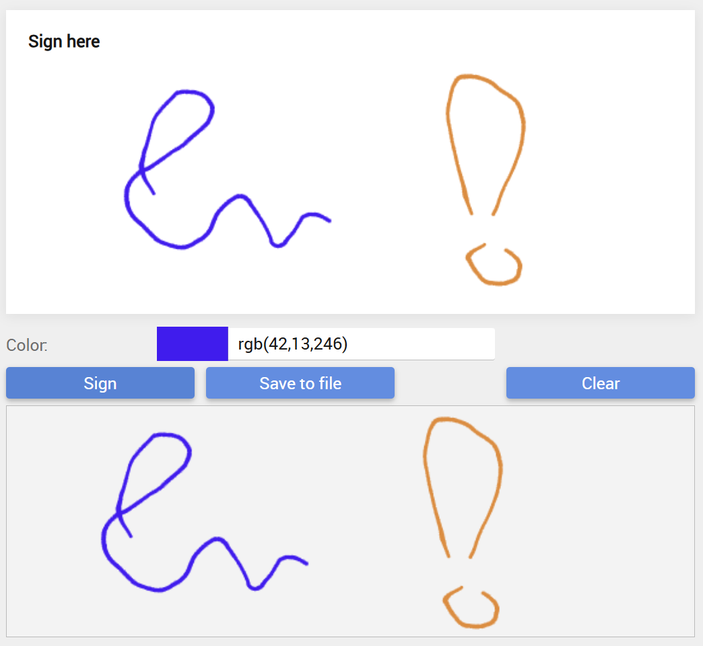

# Signature Pad
The cWebSignaturePad control wraps the http://szimek.github.io/signature_pad component into a DataFlex Web Control. This control was created as an example for building custom web controls, it is however fully functional and known to have been in production for a long time. This version of the control is tested on DataFlex 2025 – 25.0.



## Overview
- The [Demo](Demo) folder contains a sample workspace which includes a FlexTron sample demoing how the control can be used.
- The [Library](Library) folder contrains the actual library that should be attached to your workspace.
- The [Library\AppHtml\signature_pad](Library\AppHtml\signature_pad) folder contains the orrigional full unminified version of the wrapped signature component.
- The [Library\AppHtml\WebSignaturePad](Library\AppHtml\WebSignaturePad) contains the DataFlex wrapper and the minified signature_pad that should copied into your AppHtml folder.

## Usage
To use the control in your workspace perform the following actions:
- Attach the library to your workspace.
- Copy the entire [WebSignaturePad](Library\AppHtml\WebSignaturePad) folder into your AppHtml folder. 
- Add the lines below to your index.html (or use OnDefineScriptIncludes for FlexTron):
```
<script src="WebSignaturePad/signature_pad.min.js"></script>
<script src="WebSignaturePad/WebSignaturePad.js"></script>
```
 
Now the cWebSignaturePad control can be used within the application. It should show on your class palette so you can drag it onto your own views.

Optionally the following styles can be included 'AppHtml\CssStyle\Application.css' to add a border around the signature area. Especially when piImageHeight & piImageWidth are used this accentuates the exact sign area.
```
.WebSignaturePad canvas{
    border: 1px dotted black;
}
```
